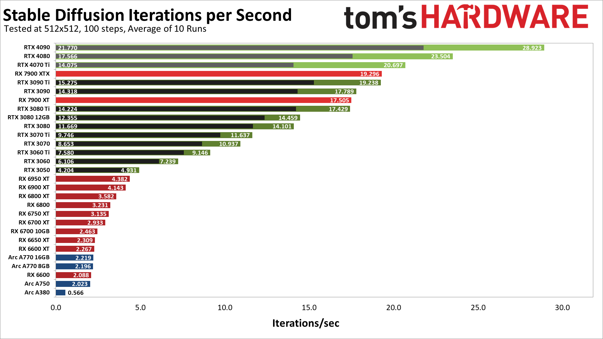

## Motivation

I have been using stable diffusion since it released qutie regularly and last few months I have seen massive improvement on my AMD GPU, both in terms of performance and size of images that I can generate locally.

The [tom's Hardware Benchmark](https://www.tomshardware.com/news/stable-diffusion-gpu-benchmarks) for stable diffusion has pretty much become a one of the go to places to check Stable Diffusion performance of a GPU. I feel it has become really out of date espcially when considering AMD GPU's so much so that the performance of my GPU is more than twice than as shown in the graph.



This is just me trying to show to show the performance improvement that has occurred on AMD GPU's in the period of time.

## Methodology

The tests were conducted on the latest `rocm/pytorch` docker container (as of 9 September 2023) , which comes preinstalled with pytorch version `rocm5.4.2` and python version `3.8.16`.

On this docker container `ComfyUI` was installed, using which the tests were then conducted.

First 1 image generation was queued, the result of which was discarded, following this 10 images were added to the queue whose result was then averaged.

> The `Efficiency Nodes for ComfyUI` module was used for the purpose of this test. ([click here for module github](https://github.com/LucianoCirino/efficiency-nodes-comfyui))

### Image prompt Details

These are basically a copy paste of what `tom's Hardware` used for their benchmark.

* Positive Prompt:

> postapocalyptic steampunk city, exploration, cinematic, realistic, hyper detailed, photorealistic maximum detail, volumetric light, (((focus))), wide-angle, (((brightly lit))), (((vegetation))), lightning, vines, destruction, devastation, wartorn, ruins

* Negative Prompt:

> (((blurry))), ((foggy)), (((dark))), ((monochrome)), sun, (((depth of field)))

* Steps:

> 100

* Classifier Free Guidance:

> 15.0

* Sampling Algorithm:
> euler_ancestral

### Workflow File

[The workflow file can be found by clicking here](d8.json)

## Computer Specs
```
GPU: AMD Radeon RX 6700 XT 12GB VRAM
CPU: Intel Core i7-12700
RAM: 64GB 3200MHz
OS: NixOS 23.05
Kernel: 6.4.1-zen1
```

## Results

The results are an average of 10 runs, conducted on `ComfyUI`.

### No Overclocking

| Model | Dreamshaper_8 (SD_1.5) | DreamShaper_XL (SDXL) |
| ----- | ------------- | -------------- |
| Image Size | 512x512 px | 1024x1024 px |
| No Flags | 4.78 it/s | 1.31 s/it |
| Flag: `--dont-upcast-attention` | 6.58 it/s | 1.04 s/it |

### My try to Overclock GPU myself with CoreCtrl

| Model | Dreamshaper_8 (SD_1.5) | DreamShaper_XL (SDXL) |
| ----- | ------------- | -------------- |
| Image Size | 512x512 px | 1024x1024 px |
| No Flags | 5.17 it/s | 1.22 s/it |
| Flag: `--dont-upcast-attention` | 7.10 it/s | 1.04 it/s |

> This was the first time I overclocked anything in my whole life and I do think there is room for improvement in the results. There were runs where I got much better speeds (~7.35 it/s on `Dreamshaper_8`) but they were not sustainable and usually resulted in errors crashing `ComfyUI`.

## Conclusion

While the `6700 XT` is not the most top of the line GPU, it does hold itself very well in terms of both price and performance, I would put it between the `RTX 3060ti` and `RTX 3060` in terms of performance. This is a great leap in performance especially when you consider that `NVIDIA` gpus haven't really gained much or anything in terms of performance.
